# PM To Dev Delivery Workflow

This document explains the end-to-end delivery workflow that starts with a raw
product request and ends with a shipped change. The workflow combines the PM
orchestration layer and the Dev orchestration layer into one continuous path.

The core idea is simple:

- PM turns unclear product work into a dev-ready package.
- Design optionally turns approved product/UI intent into visual direction,
  exploration artifacts, prototypes, system definitions, and review evidence.
- Dev turns that package into code, validation evidence, a reviewed PR, and a
  release handoff.
- Tracker updates happen at the handoff points, not as a separate delivery
  wrapper.

## Workflow Diagram

```mermaid
flowchart TD
  A["Request input<br/>Linear issue / idea / bug / project"] --> B["PM Orchestrator<br/>Read issue, comments, labels, linked PRs,<br/>attachments, docs, and repo context"]
  B --> C{"PM classification"}

  C -->|Feature or UX| D["Feature PM path<br/>PM: Intake -> PM: Problem Framing -> PM: Scope<br/>-> optional UX State / Analytics / Strategy<br/>-> PM: Specification -> PM: Technical Boundary"]
  C -->|Bug| E["Bug PM path<br/>PM: Intake -> PM: Bug Triage<br/>then engineering diagnosis when needed"]
  C -->|Project or multiple issues| F["Project PM path<br/>PM: Project Orchestrator<br/>creates child issues, dependencies, and sequence"]
  C -->|Unclear| G["Ask the smallest blocking question<br/>or split, reject, or backlog the work"]

  D --> DA{"Visual design artifact required for readiness?"}
  DA -->|Yes| DB["Design Orchestrator<br/>direction / explore / prototype / system<br/>then Design Review when needed"]
  DA -->|No| H["PM: Readiness Review"]
  DB --> H
  E --> EA{"Does expected behavior still need<br/>a product decision?"}
  EA -->|Yes| H
  EA -->|No| L
  F --> I["Dev: Project Orchestrator<br/>persistent controller, dependency graph,<br/>execution waves, and merge barriers"]
  I --> IA["Dispatch ready wave<br/>one fresh thread per issue,<br/>one concrete issue per Dev worker"]
  G --> B

  H --> J{"Ready for development?"}
  J -->|No| K["Return to PM<br/>fill missing decisions, reduce scope,<br/>split the ticket, or mark blocked"]
  J -->|Yes| L["Project Management sync<br/>move confirmed active work to In Progress"]
  L --> M["PM handoff package<br/>issue, repo, mode, PM and optional Design artifacts,<br/>scope, non-goals, acceptance criteria, constraints,<br/>validation expectations, risks"]

  M --> N["Dev Orchestrator starts<br/>resolve issue, spec, repo, mode,<br/>base branch, and branch or worktree"]
  IA --> N
  N --> NA["Dev: Git Setup<br/>claim or create the issue branch/worktree<br/>without disturbing unrelated changes"]
  NA --> O["Dev: Repository Context<br/>read current repo, patterns, tests, CI,<br/>branch state, and existing work"]
  O --> P{"Need pre-architecture investigation?"}
  P -->|Bug or regression| Q["Dev: Debugger<br/>reproduce, diagnose, and produce root-cause brief"]
  P -->|Technical uncertainty| R["Dev: Spike<br/>reduce feasibility or implementation uncertainty"]
  P -->|External API or SDK| S["Dev: API Research<br/>verify external behavior before design"]
  P -->|No| T["Dev: Architect / Refactor Architect"]

  Q --> T
  R --> T
  S --> T

  T --> TA{"Internal API contract<br/>may change?"}
  TA -->|Yes| TB["Dev: API Steward - pre-implementation<br/>lock contract intent, compatibility,<br/>docs, migration, and client impact"]
  TA -->|No| U
  TB --> U
  U["Dev: Planner<br/>ordered implementation plan,<br/>selected implementation references,<br/>validation commands, QA mode"]
  U --> V["Dev: Implementer<br/>code, focused tests, and issue-related commits"]
  V --> VA{"Internal API behavior<br/>changed?"}
  VA -->|Yes| VB["Dev: API Steward - post-implementation<br/>verify contract and update docs, examples,<br/>changelog, generated clients, and migration notes"]
  VA -->|No| W
  VB --> W
  W["Dev: Test<br/>fast mode: build, lint, typecheck, tests, smoke checks<br/>standard mode: fast checks plus hands-on QA when needed"]
  W --> X{"Technical validation pass?"}
  X -->|No, within retry limit| V
  X -->|Blocked| Y["Report concrete blocker<br/>with command output and next decision needed"]
  X -->|Yes| Z["Dev: Self Review<br/>senior-engineer review of local diff before PR"]

  Z --> AA{"Self-review findings?"}
  AA -->|Yes| V
  AA -->|No| AB["Dev: PR Writer<br/>open or reuse PR with clear summary,<br/>test evidence, and linked issue context"]

  AB --> AC["Project Management PR sync<br/>verify Linear relationships,<br/>make PR visibly reference confirmed issues,<br/>move confirmed issues to In Review"]
  AC --> AD["Dev: External Review<br/>request external technical review,<br/>post PR start comment, wait for completion"]
  AD --> AE{"Review comments, CI failures, or conflicts?"}
  AE -->|Review comments| AF["Dev: Fix<br/>address valid review feedback or conflicts"]
  AE -->|CI failures| AG["Dev: CI Repair<br/>diagnose and repair failing checks"]
  AE -->|Clean| AH["PM: PR Product Review<br/>verify the PR matches the product intent,<br/>scope, and acceptance criteria"]
  AF --> W
  AG --> W

  AH --> AI{"Product review pass?"}
  AI -->|Failed or incomplete| V
  AI -->|Blocked| Y
  AI -->|Pass| AIA{"Cross-PR integration<br/>checkpoint required?"}
  AIA -->|Yes| AIB["Dev: Integration Manager<br/>merge order, cross-PR contracts and conflicts,<br/>combined validation, rollout and rollback"]
  AIA -->|No| AJ
  AIB --> AJ["Dev: Release Handoff<br/>final per-PR merge gates in planned order,<br/>squash merge, branch cleanup,<br/>risk and rollback notes, tracker closeout"]

  AJ --> AJC{"Project-controlled worker?"}
  AJC -->|No| AK["Shipped<br/>optional PM: Release Learning for learnings,<br/>metrics to watch, release notes, and follow-ups"]
  AJC -->|Yes| AJD["Worker callback<br/>controller verifies Linear, GitHub, CI,<br/>base-branch merge, validation, and commit"]
  AJD --> AJE{"Every issue in the active wave<br/>verified Merged?"}
  AJE -->|No| AJF["Wait for callbacks or heartbeat<br/>keep dependent issues closed"]
  AJF --> AJE
  AJE -->|Yes| AJG{"More required issues?"}
  AJG -->|Yes| I
  AJG -->|No| AK
```

## Phase 1: PM Kickoff And Classification

The workflow starts with the PM Orchestrator. Its job is to gather avoidable
context before asking questions or routing work. That includes the Linear issue,
comments, labels, linked documents, linked PRs, attachments, project context,
and relevant product surface.

The first decision is classification:

- Feature or UX work goes through the PM chain until the requirement is clear
  enough for engineering.
- Bug work goes through bug triage first. A confirmed defect goes directly to
  engineering diagnosis; use the full readiness path only when expected
  behavior still needs a product decision.
- Project or multi-issue work goes to the project orchestration path before
  individual issues are handed to Dev.
- Unclear work asks the smallest question that changes routing, scope, or risk.

PM does not create branches, worktrees, commits, PRs, or implementation plans.
Its output is a product-ready handoff, not code.

## Phase 2: PM Requirement Shaping

Feature and UX work moves through the PM stages in order:

1. **PM: Intake** classifies the request and updates tracker metadata when
   appropriate.
2. **PM: Problem Framing** clarifies the user problem and business reason.
3. **PM: Scope** defines the smallest coherent version worth building.
4. **PM: Specification** writes the canonical issue description, requirements,
   and acceptance criteria.
5. **PM: Technical Boundary** records product-level technical constraints
   without turning them into implementation design.
6. **PM: Readiness Review** decides whether the issue is ready, blocked, too
   large, needs splitting, or should be rejected.

Optional PM stages are inserted only when they materially affect acceptance
criteria:

- **PM: UX State** for empty, loading, error, permission, offline, recovery, or
  copy decisions.
- **PM: UI Design** for screen layout, visual hierarchy, controls, UI copy
  placement, platform conventions, and a textual engineering-ready proposal.
- **PM: Data Analytics** for success metrics, guardrails, events, dashboards, or
  learning questions.
- **PM: Strategy** for roadmap, segment, business value, or product-principle
  fit.

## Optional Design Execution

Use the Design layer only when the user needs a visual artifact or design-system
decision beyond the PM UI proposal. Run required artifacts before PM Readiness
Review so that gate can evaluate them. `$design` routes approved intent to visual
direction, alternatives, a disposable prototype, design-system artifacts, or a
design review. A normal issue can move directly from a clear PM UI proposal to
Dev without this stage.

Design must preserve the approved product behavior. If exploration uncovers a
flow, scope, state, or acceptance-criteria change, return that decision to PM.
Design artifacts inform implementation, but Dev still owns production code and
technical architecture.

## Phase 3: PM Handoff To Dev

When the PM Readiness Review passes, the workflow performs a tracker handoff.
Confirmed active work moves to `In Progress`; blocked, speculative, future, or
related-but-out-of-scope issues are left alone.

The PM handoff package should include:

- issue and related issue IDs
- repository path
- delivery mode: fast or standard
- PM artifacts and design outputs, or the reason design was skipped
- problem, scope, non-goals, and acceptance criteria
- technical product constraints
- validation expectations
- known risks and open questions

Exactly one dev-ready issue goes to the Dev Orchestrator. Projects, milestones,
or multiple dev-ready issues go to the Dev Project Orchestrator.

For multi-issue execution, the Dev Project Orchestrator stays in the invoking
thread as the persistent controller. It builds the dependency graph, dispatches
each ready issue to a fresh `$dev` worker thread, records the worker registry,
and opens the next wave only after every issue in the active wave is verified
`Merged`. Workers never dispatch successors. The controller uses worker
callbacks, with a heartbeat as recovery, and retries a blocked issue on its
existing branch, worktree, and PR for up to five total attempts. Strict sequence
mode uses the same controller model with one issue per wave.

When project PRs share files, APIs, schemas, migrations, generated outputs, or
release behavior, the project plan must include a `$dev-integration-manager`
checkpoint before the affected PRs are merged.

## Phase 4: Dev Context, Design, And Planning

The Dev Orchestrator owns the engineering lifecycle after PM approval. It first
resolves current state, then runs **Dev: Git Setup** to claim or create the issue
branch and worktree without disturbing unrelated local changes. Only after that
does it run repository context. The resolved state includes the issue, spec,
repo, mode, base branch, branch or worktree, existing PRs, CI, and tracker
status.

The default Dev goal is to address the approved feature or bug and merge the PR.
PR creation, local validation, requested external review, or pending CI is not a terminal
state unless the user explicitly asked for a narrower PR-only boundary.

Dev roles are role boundaries, not always independent agents. The Dev
Orchestrator owns state transitions and may delegate bounded read/report phases
to sub-agents. Mutating phases run serially on the active branch or worktree,
and high-impact external mutations such as tracker changes, PR creation, merge,
branch cleanup, and worktree cleanup stay owned or explicitly gated by the Dev
Orchestrator.

Then it runs repository context before architecture. Depending on the issue, Dev
may insert one or more investigation stages:

- **Dev: Debugger** for bugs, regressions, crashes, hangs, wrong behavior, flaky
  behavior, or failed acceptance checks.
- **Dev: Spike** when technical feasibility or implementation direction is
  genuinely uncertain.
- **Dev: API Research** when the work depends on third-party API, SDK, auth,
  webhook, pricing, sandbox, rate-limit, or data-model behavior.

After that, **Dev: Architect** turns feature or bug-fix handoffs plus repo
evidence into a technical approach. For refactor-first work, **Dev: Refactor
Architect** defines behavior invariants, affected modules, migration order,
risk areas, rollback strategy, and split recommendations.

When the work may change an internal API, schema-visible behavior, generated
client, auth, pagination, webhook, or error model, **Dev: API Steward** runs a
pre-implementation contract review after architecture and before the final
plan. It locks contract intent, compatibility, documentation targets, migration
guidance, and client impact. **Dev: Planner** then converts the architecture and
contract decisions into ordered implementation steps, selected implementation
references, validation commands, QA mode, and release expectations.

## Phase 5: Implementation And Technical Validation

**Dev: Implementer** makes the code changes using the narrowest implementation
reference that matches the touched surface, such as iOS, macOS, SwiftUI, web,
backend, or Supabase. The implementer keeps changes tied to the approved scope
and leaves unrelated dirty work untouched.

For API-changing work, **Dev: API Steward** runs again after implementation and
before testing. This post-implementation closeout compares the actual diff with
the intended contract and updates OpenAPI/Swagger, generated clients, docs,
examples, changelog, versioning, and migration notes when required.

**Dev: Test** then runs the project-appropriate QA bar.

Fast mode is the default:

- build
- lint
- typecheck
- unit or integration tests
- migration, schema, contract, or smoke checks when available

Standard mode starts with the same automated bar, then adds hands-on simulator,
device, live-app, or browser QA only when explicitly requested or genuinely
required for responsible validation.

Failed validation loops back to implementation. The Dev workflow allows at most
three implementation/test repair attempts for the same failing check and at
most five review/CI repair loops before stopping with a concrete blocker.

## Phase 6: Self Review, PR, And Tracker Sync

Before opening a PR, **Dev: Self Review** reviews the local diff as a strict
senior engineer. Valid findings are fixed and focused validation is rerun.

Then **Dev: PR Writer** opens or reuses the PR. The PR should include a clear
summary, validation evidence, risk notes when relevant, and issue context.

Immediately after PR creation, the workflow performs a PR traceability sync:

- verify related issue IDs from the PM handoff, issue relationships, branch,
  commits, PR title, and PR body
- make the PR visibly reference every confirmed issue
- move only confirmed in-scope issues to `In Review`
- pause before mutating tracker state if branch names, commits, PR metadata,
  PM handoff, and Linear relationships disagree

## Phase 7: Review, CI Repair, And Product Review

**Dev: External Review** invokes the project-configured external technical
review after PR traceability sync. When the provider accepts the request, it
posts a concise PR comment saying the external review started, then waits for a
finished signal before treating review as clean. `$dev` does not run a local or
no-context fallback review in this default workflow.

If review comments, merge conflicts, or CI failures appear, the workflow routes
them through the right repair path:

- **Dev: Fix** handles valid review comments and merge conflicts.
- **Dev: CI Repair** handles failing GitHub Actions, build, lint, test, or
  typecheck checks.

Every repair commit reruns relevant validation. The workflow stops after the
review or CI repair limit is reached with a concrete blocker and evidence.

After technical review is clean or explicitly handled, **PM: PR Product Review**
checks whether the PR still matches the product intent, approved scope, and
acceptance criteria. This is separate from Dev testing:

- Dev testing proves technical correctness.
- PM product review proves requirement conformance.

If the product review fails as different or incomplete, the work returns to
implementation and validation before another product review.

## Phase 8: Project Integration, Release Handoff, And Closeout

For interacting PRs, **Dev: Integration Manager** runs before merge. It chooses
direct ordered merge, a temporary integration branch, or blocked status; checks
cross-PR API/schema/client contracts and conflicts; runs combined validation;
and records rollout and rollback risk. It does not add product scope or use the
integration branch as the final merge vehicle unless the user explicitly asks
for that branch strategy.

Each PR still lands through **Dev: Release Handoff** in the planned order. After
every merge, the integration manager refreshes the base branch and re-checks
the remaining PRs.

**Dev: Release Handoff** owns the final release gate:

- final PR status and mergeability
- unresolved comments
- conflict state
- required checks
- squash merge or repository-approved landing path
- branch cleanup
- tracker closeout
- release notes, risk notes, and rollback notes when relevant

After merge, the default Dev goal is complete. **PM: Release Learning** can
then capture product learning, metrics to watch, release notes, changelog text,
and follow-up issues.

For project-controlled workers, merge is followed by a callback to the Dev
Project Orchestrator. The controller independently verifies Linear, GitHub, CI,
and base-branch state, opens the wave barrier only when every active-wave issue
is `Merged`, and dispatches unlocked successors exactly once. The project is
complete only when every required issue is verified merged and every planned
integration checkpoint has passed.

## Responsibilities By Layer

| Layer | Owns | Does Not Own |
| --- | --- | --- |
| PM | problem, scope, product behavior, acceptance criteria, readiness, product review | branches, worktrees, commits, PR creation, technical implementation |
| Design | visual direction, exploration, disposable prototypes, design-system artifacts, design review | product scope, tracker authority, production architecture or implementation |
| Dev | git setup, repo context, technical design, API stewardship, implementation, validation, PR, external review, CI repair, project execution control, cross-PR integration, release handoff | changing approved product scope without returning to PM |
| Project Management | tracker status sync, PR traceability, confirmed issue relationships | speculative issue movement or unrelated tracker cleanup |

## Default Modes

| Mode | When Used | QA Bar |
| --- | --- | --- |
| Fast | Default for normal Dev work, non-visual changes, and build-plus-tests requests | Automated build, lint, typecheck, tests, and available smoke checks |
| Standard | Explicit full QA, simulator/device/live-app/manual browser QA, or behavior that cannot be responsibly validated automatically | Fast mode checks plus hands-on QA |

## Completion Criteria

The workflow is complete only when all required gates are done or explicitly
blocked:

- PM readiness passed or the issue was correctly routed elsewhere.
- Any requested Design artifact was approved and its review blockers were resolved or explicitly accepted.
- Tracker moved confirmed active work to `In Progress`.
- Dev implementation is complete and scoped to the approved requirement.
- Technical validation passed or has a concrete blocker.
- Self review passed.
- PR exists and references the confirmed issue set.
- Confirmed issues moved to `In Review`.
- External review and CI are clean or explicitly handled.
- Product review passed or was explicitly out of scope.
- PR is merged through the repository-approved landing path.
- Release handoff completed merge confirmation, cleanup, closeout, and risk notes.
- For multi-issue work, every active-wave merge barrier opened from verified live state, all required issues are merged, and every planned integration checkpoint passed.

