# PM 到 Dev 交付流程

本文档说明一条端到端交付流程：从原始产品需求开始，到代码完成、PR 通过评审并完成上线交接为止。这个流程把 PM 编排层和 Dev 编排层串成一条连续路径。

核心原则很简单：

- PM 把不清楚的产品工作收敛成开发就绪包。
- Dev 把开发就绪包变成代码、验证证据、已评审 PR 和上线交接。
- Tracker 状态更新发生在关键交接点，而不是依赖单独的交付包装器。

## 流程图

```mermaid
flowchart TD
  A["需求输入<br/>Linear issue / 想法 / Bug / 项目"] --> B["PM 编排器<br/>读取 issue、评论、标签、关联 PR、<br/>附件、文档和仓库上下文"]
  B --> C{"PM 分类"}

  C -->|功能或 UX| D["功能 PM 路径<br/>PM：需求分类 -> PM：问题定义 -> PM：范围界定<br/>-> 可选 UX 状态 / 数据分析 / 战略判断<br/>-> PM：规格说明 -> PM：技术边界"]
  C -->|Bug| E["Bug PM 路径<br/>PM：需求分类 -> PM：缺陷分诊<br/>必要时进入工程诊断"]
  C -->|项目或多个 issue| F["项目 PM 路径<br/>PM：项目编排器<br/>创建子 issue、依赖关系和执行顺序"]
  C -->|不清楚| G["提出最小阻塞问题<br/>或拆分、拒绝、放入 backlog"]

  D --> H["PM：开发就绪评审"]
  E --> H
  F --> I["Dev：项目编排器<br/>多 issue 执行计划"]
  G --> B

  H --> J{"是否开发就绪？"}
  J -->|否| K["返回 PM<br/>补齐决策、缩小范围、<br/>拆票或标记阻塞"]
  J -->|是| L["项目管理状态同步<br/>将确认的 active work 移到 In Progress"]
  L --> M["PM 交接包<br/>issue、repo、mode、PM 产物、范围、<br/>非目标、验收标准、约束、<br/>验证预期、风险"]

  M --> N["Dev 编排器启动<br/>确认 issue、spec、repo、mode、<br/>base branch、branch 或 worktree"]
  N --> O["Dev：仓库上下文<br/>读取当前仓库、模式、测试、CI、<br/>分支状态和既有工作"]
  O --> P{"是否需要架构前调查？"}
  P -->|Bug 或回归| Q["Dev：调试诊断<br/>复现、诊断并产出根因简报"]
  P -->|技术不确定性| R["Dev：技术 Spike<br/>降低可行性或实现路径的不确定性"]
  P -->|外部 API 或 SDK| S["Dev：API 研究<br/>设计前确认外部行为"]
  P -->|不需要| T["Dev：技术架构"]

  Q --> T
  R --> T
  S --> T

  T --> U["Dev：实施计划<br/>有序实现步骤、选定实现参考、<br/>验证命令、QA mode"]
  U --> V["Dev：实现<br/>代码、focused tests 和 issue 相关提交"]
  V --> W["Dev：测试<br/>fast mode：build、lint、typecheck、tests、smoke checks<br/>standard mode：fast checks 加必要 hands-on QA"]
  W --> X{"技术验证是否通过？"}
  X -->|未通过，仍在重试限制内| V
  X -->|阻塞| Y["报告具体 blocker<br/>包含命令输出和需要的下一步决策"]
  X -->|通过| Z["Dev：自审<br/>开 PR 前以 senior engineer 视角审查本地 diff"]

  Z --> AA{"自审是否有问题？"}
  AA -->|有| V
  AA -->|无| AB["Dev：PR 撰写<br/>创建或复用 PR，包含清晰摘要、<br/>测试证据和关联 issue 上下文"]

  AB --> AC["项目管理 PR 同步<br/>验证 Linear 关系、<br/>让 PR 明确引用确认的 issue、<br/>将确认 issue 移到 In Review"]
  AC --> AD["Dev：代码评审<br/>技术 PR 评审，确认评论已发布或发现已返回"]
  AD --> AE{"是否有评审意见、CI 失败或冲突？"}
  AE -->|评审意见| AF["Dev：修复<br/>处理有效评审反馈或冲突"]
  AE -->|CI 失败| AG["Dev：CI 修复<br/>诊断并修复失败检查"]
  AE -->|干净| AH["PM：PR 产品评审<br/>确认 PR 符合产品意图、<br/>范围和验收标准"]
  AF --> W
  AG --> W

  AH --> AI{"产品评审是否通过？"}
  AI -->|失败或不完整| V
  AI -->|阻塞| Y
  AI -->|通过| AJ["Dev：上线交接<br/>最终合并门禁、冲突和检查状态、<br/>squash merge、分支清理、<br/>风险和回滚说明、tracker closeout"]

  AJ --> AK["已上线<br/>可选 PM：发布学习，记录学习、<br/>关注指标、release notes 和 follow-ups"]
```

## 阶段 1：PM 启动与分类

流程从 PM 编排器开始。它的职责是在提问或路由前尽量收集可获得的上下文，包括 Linear issue、评论、标签、关联文档、关联 PR、附件、项目上下文和相关产品界面。

第一步决策是分类：

- 功能或 UX 工作进入 PM 链路，直到需求清晰到足以交给工程。
- Bug 工作先做缺陷分诊；如果确认是产品缺陷，再进入工程诊断。
- 项目或多 issue 工作先走项目编排路径，再把单个 issue 交给 Dev。
- 不清楚的工作只提出会改变路由、范围或风险的最小问题。

PM 不创建分支、worktree、commit、PR 或实现计划。PM 的输出是产品就绪交接包，而不是代码。

## 阶段 2：PM 需求成型

功能和 UX 工作按顺序经过以下 PM 阶段：

1. **PM：需求分类** 对请求分类，并在合适时更新 tracker 元数据。
2. **PM：问题定义** 澄清用户问题和业务原因。
3. **PM：范围界定** 定义值得构建的最小完整版本。
4. **PM：规格说明** 编写 canonical issue 描述、需求和验收标准。
5. **PM：技术边界** 记录产品层面的技术约束，但不把它变成实现设计。
6. **PM：开发就绪评审** 判断 issue 是否就绪、阻塞、过大、需要拆分或应该拒绝。

只有当额外阶段会实质影响验收标准时才插入：

- **PM：UX 状态** 用于 empty、loading、error、permission、offline、recovery 或文案决策。
- **PM：数据分析** 用于成功指标、护栏指标、事件、dashboard 或学习问题。
- **PM：战略判断** 用于路线图、用户分群、业务价值或产品原则判断。

## 阶段 3：PM 交接到 Dev

当 PM 开发就绪评审通过后，流程执行 tracker 交接。已确认的 active work 移到 `In Progress`；阻塞的、推测性的、未来的、或相关但不在本次范围内的 issue 不动。

PM 交接包应该包含：

- issue 和相关 issue ID
- 仓库路径
- 交付模式：fast 或 standard
- PM 产物和设计输出，或跳过设计的原因
- 问题、范围、非目标和验收标准
- 产品层面的技术约束
- 验证预期
- 已知风险和开放问题

只有一个开发就绪 issue 时，交给 Dev 编排器。项目、里程碑或多个开发就绪 issue，交给 Dev 项目编排器。

## 阶段 4：Dev 上下文、技术设计与计划

PM 批准后，Dev 编排器负责工程生命周期。它先确认当前状态：issue、spec、repo、mode、base branch、branch 或 worktree、现有 PR、CI 和 tracker 状态。

然后在架构前读取仓库上下文。根据 issue 类型，Dev 可能插入一个或多个调查阶段：

- **Dev：调试诊断** 用于 Bug、回归、崩溃、卡死、错误行为、flaky 行为或失败的验收检查。
- **Dev：技术 Spike** 用于技术可行性或实现方向确实不确定的场景。
- **Dev：API 研究** 用于依赖第三方 API、SDK、认证、webhook、价格、sandbox、rate limit 或数据模型行为的工作。

随后，**Dev：技术架构** 把产品交接包和仓库证据转成技术方案；**Dev：实施计划** 再把方案转成有序实现步骤、选定实现参考、验证命令、QA mode 和上线预期。

## 阶段 5：实现与技术验证

**Dev：实现** 根据触达面选择最窄的实现参考，例如 iOS、macOS、SwiftUI、web、backend 或 Supabase。实现阶段只处理已批准范围内的变更，并保留无关 dirty work 不动。

**Dev：测试** 运行符合项目类型的 QA 标准。

Fast mode 是默认模式：

- build
- lint
- typecheck
- unit 或 integration tests
- 可用时执行 migration、schema、contract 或 smoke checks

Standard mode 先执行同样的自动化检查；只有用户明确要求，或确实需要 hands-on QA 才能负责任地验证行为时，才额外加入 simulator、device、live-app 或 browser QA。

验证失败会回到实现阶段。对同一个检查反复失败达到限制后，流程会带着具体 blocker 停下，而不是无限游走。

## 阶段 6：自审、PR 与 Tracker 同步

开 PR 前，**Dev：自审** 以严格 senior engineer 的标准审查本地 diff。有效问题需要修复，并重新运行 focused validation。

然后 **Dev：PR 撰写** 创建或复用 PR。PR 应包含清晰摘要、验证证据、相关风险说明和 issue 上下文。

PR 创建后，流程立即执行 PR traceability sync：

- 从 PM 交接包、issue 关系、branch、commit、PR 标题和 PR 正文中验证相关 issue ID
- 让 PR 明确引用每个已确认 issue
- 只把确认在本次范围内的 issue 移到 `In Review`
- 如果 branch 名、commit、PR metadata、PM 交接包和 Linear 关系互相矛盾，先暂停再更新 tracker 状态

## 阶段 7：评审、CI 修复与产品评审

**Dev：代码评审** 执行技术 PR 评审。如果出现评审意见、合并冲突或 CI 失败，流程路由到对应的修复路径：

- **Dev：修复** 处理有效评审意见和合并冲突。
- **Dev：CI 修复** 处理失败的 GitHub Actions、build、lint、test 或 typecheck 检查。

每个修复提交后都要重新运行相关验证。达到评审或 CI 修复限制后，流程会带着具体 blocker 和证据停下。

技术评审干净或已明确处理后，**PM：PR 产品评审** 检查 PR 是否仍然符合产品意图、已批准范围和验收标准。它和 Dev 测试是分开的：

- Dev 测试证明技术正确性。
- PM 产品评审证明需求一致性。

如果产品评审结果是不同或不完整，工作回到实现和验证，然后再次产品评审。

## 阶段 8：上线交接与收尾

**Dev：上线交接** 负责最终 release gate：

- 最终 PR 状态和可合并性
- 未解决评论
- 冲突状态
- required checks
- squash merge 或仓库批准的 landing path
- 分支清理
- tracker closeout
- 需要时补充 release notes、风险说明和回滚说明

合并后，**PM：发布学习** 可以记录产品学习、需要关注的指标、release notes、changelog 文案和 follow-up issues。

## 分层职责

| 层 | 负责 | 不负责 |
| --- | --- | --- |
| PM | 问题、范围、产品行为、验收标准、开发就绪、产品评审 | 分支、worktree、commit、PR 创建、技术实现 |
| Dev | 仓库上下文、技术设计、实现、验证、PR、代码评审、CI 修复、上线交接 | 未回到 PM 就改变已批准产品范围 |
| Project Management | tracker 状态同步、PR traceability、确认的 issue 关系 | 推测性 issue 移动或无关 tracker 清理 |

## 默认模式

| 模式 | 何时使用 | QA 标准 |
| --- | --- | --- |
| Fast | 普通 Dev 工作、非视觉变更、或 build-plus-tests 请求的默认模式 | 自动化 build、lint、typecheck、tests 和可用 smoke checks |
| Standard | 明确要求完整 QA、simulator/device/live-app/manual browser QA，或无法只靠自动化负责任验证的行为 | Fast mode 检查加 hands-on QA |

## 完成标准

只有所有必要门禁完成或明确阻塞后，流程才算完成：

- PM 开发就绪评审通过，或 issue 已正确路由到其他路径。
- Tracker 将确认的 active work 移到 `In Progress`。
- Dev 实现完成，并且范围符合已批准需求。
- 技术验证通过，或已有具体 blocker。
- 自审通过。
- PR 存在，并引用确认的 issue 集合。
- 确认的 issue 已移到 `In Review`。
- 代码评审和 CI 干净，或已明确处理。
- 产品评审通过，或用户明确说不在本次范围内。
- 上线交接完成 merge readiness、closeout 和风险说明。

