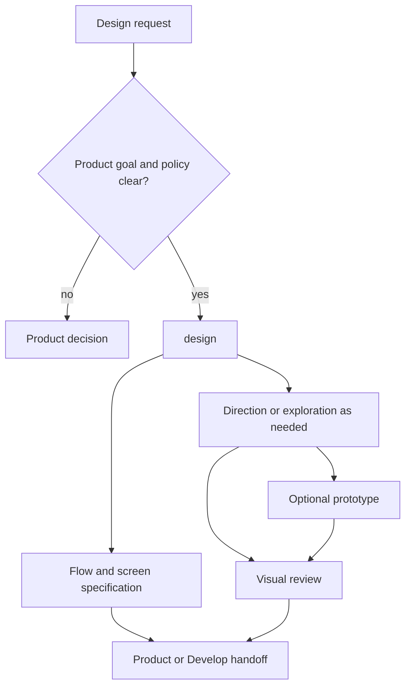

# Design plugin

Design turns clear product intent into user flows, interaction states, screen
specifications, visual artifacts, design systems and review evidence. It can
run on its own or as an optional Product/Develop branch.

## Main entrypoints

- [`design`](skills/design/SKILL.md) produces a textual interaction/screen
  specification or selects the smallest visual workflow.
- [`design-direction`](skills/design-direction/SKILL.md) defines visual principles.
- [`design-explore`](skills/design-explore/SKILL.md) produces comparable alternatives.
- [`design-prototype`](skills/design-prototype/SKILL.md) creates an interactive
  proof when interaction needs validation.
- [`design-system`](skills/design-system/SKILL.md) maintains reusable system decisions.
- [`design-review`](skills/design-review/SKILL.md) evaluates a selected result.

## Workflow

A text-only UX/UI handoff does not require mockups, prototypes or the visual
pipeline. Design owns how the confirmed promise is experienced and presented;
PM owns scope, policy and canonical acceptance, and Dev owns production code.
No prior PM UX/UI Skill output is required. Install with
`codex plugin add design@jay1803-ship-skills`. Individual Skills define artifact and
publication boundaries.
