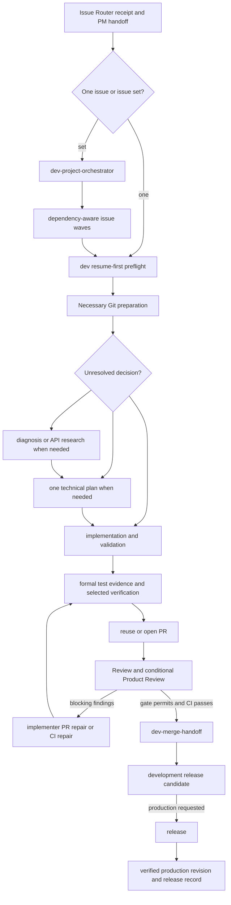

# Develop plugin

Develop delivers dev-ready engineering work through implementation, validation,
pull request, review, CI, merge handoff, and production-release handoff. It
supports one issue, dependency-aware issue sets, focused diagnosis and repair,
and explicit cross-PR integration.

## Main entrypoints

- [`dev`](skills/dev/SKILL.md) owns the complete lifecycle for one dev-ready
  issue and supports fast, standard, and strict modes (standard blocks P0/P1; strict blocks P0/P1/P2).
- [`dev-project-orchestrator`](skills/dev-project-orchestrator/SKILL.md) owns
  engineering waves, barriers, and aggregation for a ready issue set.
- [`dev-planner`](skills/dev-planner/SKILL.md) resolves technical choices and
  sequencing in one plan, with conditional domain and refactor guidance.
- [`dev-implementer`](skills/dev-implementer/SKILL.md) owns scoped implementation
  and PR repair, with conditional TDD and PR-comment/conflict guidance.
- [`dev-debugger`](skills/dev-debugger/SKILL.md),
  [`dev-spike`](skills/dev-spike/SKILL.md), and
  [`dev-api-research`](skills/dev-api-research/SKILL.md) provide bounded
  investigation paths.
- [`dev-integration-manager`](skills/dev-integration-manager/SKILL.md) integrates
  an explicit PR set using the supplied ordering strategy.

Repository setup, deployment-skill authoring, and production releases are
provided by the separately installed DevOps plugin. Install it when using those
entrypoints or following a production-release handoff.

## Workflow

The Product plugin is required for `$dev` and `$dev-project-orchestrator`
because those entrypoints consume Product's read-only Issue Router receipt.
Technical review is delegated to the independently installable Review plugin.
Platform-specific Apple work can use the Apple Development plugin inside the
same Dev lifecycle.

Install with `codex plugin add develop@jay1803-ship-skills` after installing Product.
Behavioral gates and mutation authority live in the individual Skills and their
references, not in this overview.

## Consolidated Skill Surface

Develop contains 16 independent Skills. Keep one suitable implementation owner
for scoped coding, test/failure classification, and repair when context, tools,
permissions, and capability match. Phase responsibilities and controller
acceptance remain explicit; a new phase name alone does not require a new agent.
Delegate for independent judgment, isolation, useful parallelism, capability,
or an explicit request. Independent technical Review and any explicitly
independent verification remain separate.

Repository discovery happens inside the current owner when a fact is missing.
Technical planning produces one decision-oriented artifact; domain/refactor
analysis expands that plan only when needed. Testing may reuse inspectable,
matching evidence and reruns missing, invalidated, or explicitly fresh checks.

## Invocation Migration

Update saved prompts and automation callers when adopting this consolidation:

| Retired entry | Current destination |
| --- | --- |
| `dev-repo-context` | Current planning/implementation owner gathers bounded repository facts |
| `dev-architect` | `dev-planner` technical approach, with slices only when needed |
| `dev-refactor-architect` | `dev-planner` with `references/refactor.md` |
| `dev-domain-modeling` | `dev-planner` with `references/domain-modeling.md` |
| `dev-tdd` | `dev-implementer` with `references/tdd.md` |
| `dev-fix` | `dev-implementer` with `references/pr-repair.md`; existing PR and Review Run preserved |
| `dev-release-handoff` | `dev-merge-handoff` for an issue integration PR, or DevOps `release` for production promotion |

The `post-pr/fix` router variant remains valid and now names the implementer
repair path. Retired Skill directories and compatibility routers are not
distributed. Historical receipts remain evidence, not permission to replay a
retired entry or reset a repair counter. Plugin publication and consumer
installation are separate from this source change; consumers using old names
must update their calls when installing the new package.
