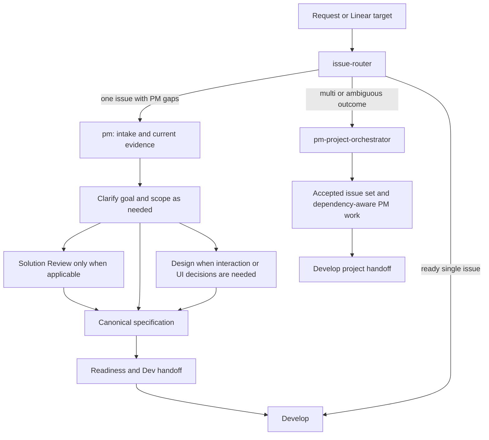

# Product plugin

Product turns an unclear request into a confirmed product decision, a dev-ready
issue or a dev-ready issue set. It owns intent, scope, canonical requirements,
readiness and product conformance. Design owns UX/UI artifacts; Develop owns
implementation and engineering verification.

## Main entrypoints

- [`issue-router`](skills/issue-router/SKILL.md) selects the workflow owner for
  a bound issue/project. Its receipt does not grant mutation authority.
- [`pm`](skills/pm/SKILL.md) owns one issue, including intake and metadata, and
  fills missing decisions through one combined readiness/Dev handoff.
- [`pm-scope`](skills/pm-scope/SKILL.md) clarifies the problem, desired outcome
  and smallest buildable scope together.
- [`pm-spec`](skills/pm-spec/SKILL.md) owns the current canonical issue/PRD.
- [`pm-project-orchestrator`](skills/pm-project-orchestrator/SKILL.md) owns
  multi-issue decomposition, dependency-aware preparation and project handoff.
- [`pm-project-status`](skills/pm-project-status/SKILL.md) reports current Linear
  roadmap, milestones and shipment evidence without mutating delivery state.
- [`pm-strategy`](skills/pm-strategy/SKILL.md) frames product direction.
- [`pm-pr-product-review`](skills/pm-pr-product-review/SKILL.md) checks a built
  change against confirmed intent when requested or required.

## Workflow

These are evidence dependencies, not a checklist of mandatory comments or agent
calls. Existing complete tickets can enter readiness directly. Bugs reuse
triage/diagnosis, verify or repair the canonical restoration scope, then enter
readiness. Solution Review applies to material rule/simplification questions or
an explicit request/policy; non-Bug classification alone does not require it.
Technical product constraints are investigated before specification when they
can change scope or acceptance. Independent reviews retain their judgment.

Standalone classification, framing, PRDs and reviews finish at the requested
artifact without tracker setup. Only material decisions/supporting evidence and
the combined handoff need PM replies. Confirmed changes reach all authorized
affected active-scope issues through their canonical Spec owners, including
cross-parent dependencies. Publication, status changes and new tasks retain the
user's exact authorization.

## Consolidated entrypoints

The Product inventory has 14 Skills. Intake is part of `pm`; problem framing is
part of `pm-scope`; technical constraints are an on-demand `pm-spec` reference.
The retired `pm-intake`, `pm-problem-framing`, `pm-technical-boundary`,
`pm-ux-state` and `pm-ui-design` are no longer discovery entries or compatibility
routers. Update saved prompts to the current owners.

Use `$design` for journeys, states, recovery presentation, screen hierarchy,
controls and copy. A text specification is sufficient when no visual artifact
is needed; no prior PM UX/UI output or complete visual pipeline is required.
PM still confirms product policy, scope and acceptance. Install Design when that
capability is needed; missing Design does not block unrelated PM work.

Install Product with `codex plugin add product@jay1803-ship-skills`. Develop lifecycle
entrypoints require Product's Issue Router. `linear-cli` remains a standalone
integration installed separately through the standalone linker. Source changes
do not publish plugin releases or update installed consumers.
