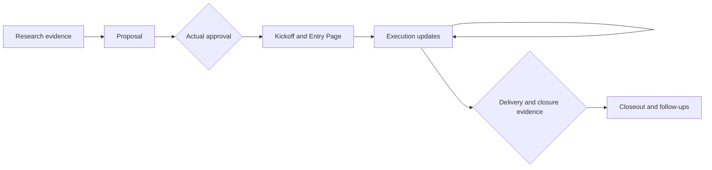

# Project plugin

Project prepares and maintains documents from a stakeholder proposal through
kickoff, execution updates and closeout. It resumes from existing records and
can finish authorized drafting, review and revision within a stage. Real
approval, commitments and delivery evidence govern stage transitions.

## Main entrypoints

- [`project`](skills/project/SKILL.md) selects or resumes the document task.
- [`proj-proposal`](skills/proj-proposal/SKILL.md) makes the case and the ask,
  including a short go/no-go brief when that is the requested artifact.
- [`proj-kickoff`](skills/proj-kickoff/SKILL.md) translates approved scope into
  execution agreements and creates or reuses the Project Entry Page.
- [`proj-update`](skills/proj-update/SKILL.md) gathers relevant new evidence,
  reconciles current state and prepares stakeholder updates; log-only is supported.
- [`proj-closeout`](skills/proj-closeout/SKILL.md) records delivery, handover,
  measured results, lessons and outstanding responsibility.
- [`proj-review`](skills/proj-review/SKILL.md) reviews any stage's document.
- [`proj-sources`](skills/proj-sources/SKILL.md) and
  [`proj-context`](skills/proj-context/SKILL.md) support discovery and onboarding.

## Lifecycle and records

Each stage can draft, review and revise without repeated permission requests
inside existing authorization. A document review does not approve investment,
commit resources or close the project. A one-stage request ends at that stage.
No scheduler, background listener or message sending is implied.

The proposal preserves the decision rationale and approved revision. The Entry
Page holds the current overview, links to that baseline, resources, changes,
source coverage and next action. Updates preserve the original commitments
alongside accepted replans. Closeout distinguishes delivered work from business
impact and records later measurement. See the shared
[document contract](skills/project/references/document-contract.md).

Use the requested document platform or local Markdown. Missing connectors produce
honest drafts/gaps, never claims of publication. Product owns product scope and
Linear roadmap status; Develop owns engineering issue/PR/CI/merge transitions.
Project can read their records as evidence without becoming a competing writer.

## Migration

| Former entrypoint | Current owner |
| --- | --- |
| `proj-init`, `proj-setup` | `proj-proposal`; approved execution setup goes to `proj-kickoff` |
| `proj-bet` | `proj-proposal` short decision brief and optional decision methods |
| `proj-update-info` | `proj-update` log-only reconciliation |
| `proj-manage` | Product `pm-project-status` for status; existing Product/Develop owners for mutations |
| Former references to `setup-project-page` / `project-status-collector` | `proj-kickoff` / `proj-update` |

These retired names are no longer discovery entries. Existing documents remain
valid inputs; reuse them rather than renaming or recreating a user's records.
Update saved prompts to the current names. Project has eight Skills and remains
independently installable; install Product/Develop only for their workflows.

Install with `codex plugin add project@jay1803-ship-skills`. Source integration does
not publish a release or update installed consumers.
