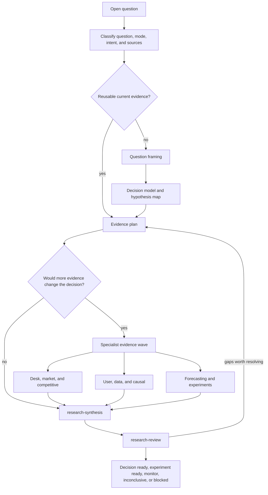

# Research plugin

Research turns an open question into decision-ready evidence. It frames the
decision, chooses only evidence that can change it, runs appropriate specialist
work, synthesizes uncertainty, and independently reviews the result.

## Main entrypoints

- [`research`](skills/research/SKILL.md) owns question classification, planning,
  evidence waves, synthesis, and completion.
- Framing skills cover the question, decision model, hypothesis map, and
  evidence plan.
- Specialist skills cover desk, competitive, market, user, data, causal,
  forecasting, and experiment-design work.
- [`research-synthesis`](skills/research-synthesis/SKILL.md) integrates the
  evidence and [`research-review`](skills/research-review/SKILL.md) checks
  decision readiness.

## Workflow

Research may inform Product, Project, or engineering work, but it does not make
their canonical writes or delivery decisions. Install with
`codex plugin add research@jay1803-ship-skills`. Source policy and terminal criteria
remain defined by the Skills.
