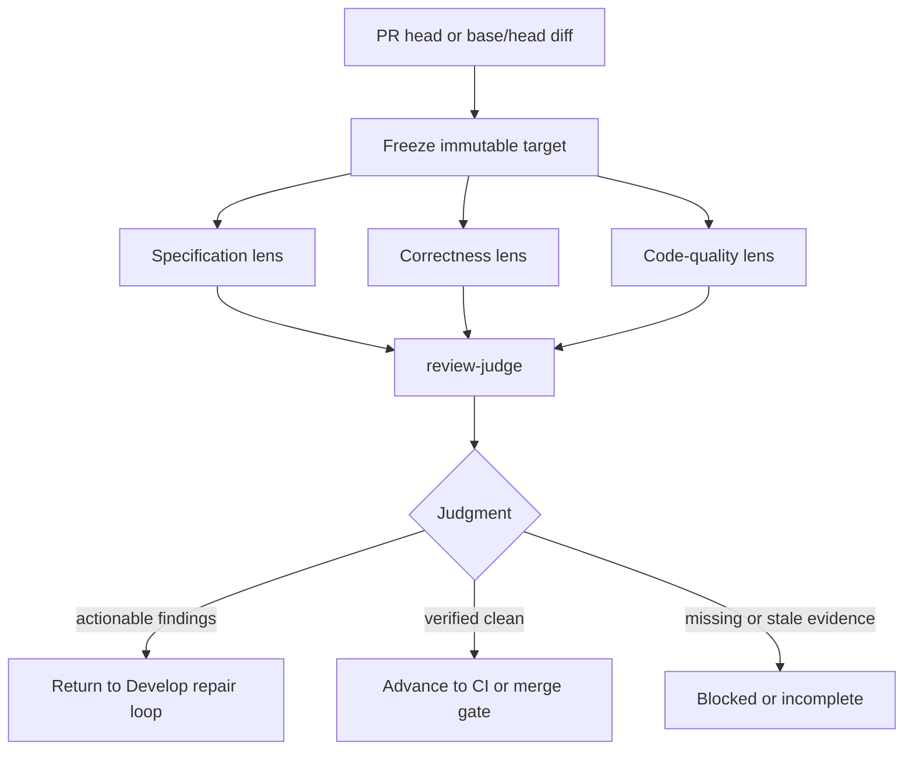

# Review plugin

Review independently evaluates an immutable pull-request head or explicit
base/head diff. It keeps specification, correctness, and code-quality analysis
isolated, preserves the provenance of every finding, and returns one judged
result to the caller.

## Main entrypoints

- [`review`](skills/review/SKILL.md) freezes the target and orchestrates the
  review lenses.
- [`review-spec`](skills/review-spec/SKILL.md),
  [`review-correctness`](skills/review-correctness/SKILL.md), and
  [`review-code-quality`](skills/review-code-quality/SKILL.md) own independent
  analysis surfaces.
- [`review-judge`](skills/review-judge/SKILL.md) verifies and combines source
  findings without erasing their provenance.

- [`review-pr`](skills/review-pr/SKILL.md) provides focused production-code
  structural review and posts inline comments only when explicitly requested.

## Workflow

Review does not merge, repair, or silently change the frozen target. Install it
with `codex plugin add review@jay1803-ship-skills`. Exact severity, provenance, and
mode rules live in the corresponding Skills and references.
